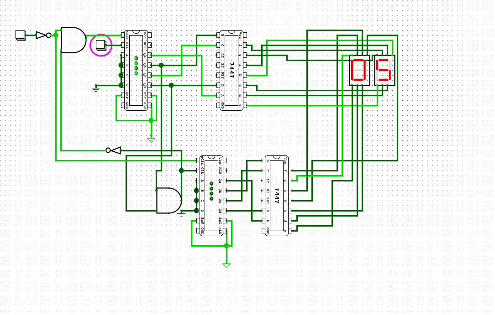

# Digital Counter Circuit

A digital logic circuit designed and simulated in Logisim that functions as a 
turnstile counter, tracking how many people pass through a door per day.

## How It Works

A button represents a turnstile. Each press increments the counter by one.
The current count is displayed in real time on two 7-segment displays.
A separate reset button clears the display back to zero, ready for the next day.

## Features

- Button-activated counter simulating a real-world turnstile
- Count displayed on dual 7-segment displays
- Reset functionality to clear the counter
- Modular and scalable design — additional displays can be chained on to 
  support larger counts with minimal changes to the circuit

## Scalability

The circuit is designed with expansion in mind. Each digit is handled by its 
own counter and BCD decoder stage, meaning new digits can be added by chaining 
additional counter and 7447 decoder units. There is no fundamental limit to 
how high the counter can count — just add another stage for each new digit 
you need.

## Components Used

- JK Flip-Flops (sequential logic / state storage)
- 7447 BCD-to-7-segment decoders
- Seven-segment displays
- Logic gates (AND, NOT)
- Clock input

## Technologies

- Logisim (digital logic simulation)
- Digital logic design
- Sequential and combinational circuits

## Circuit Preview

